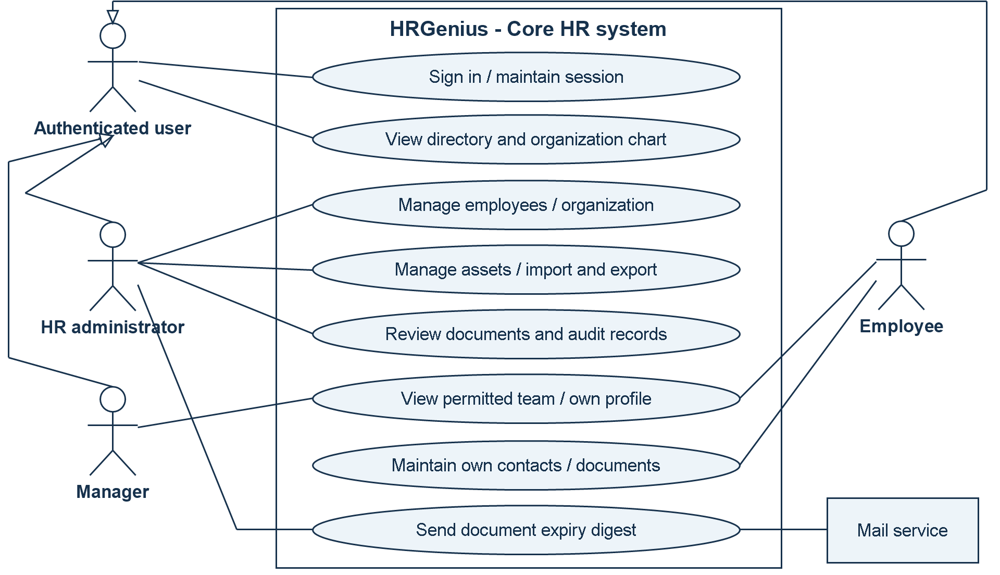
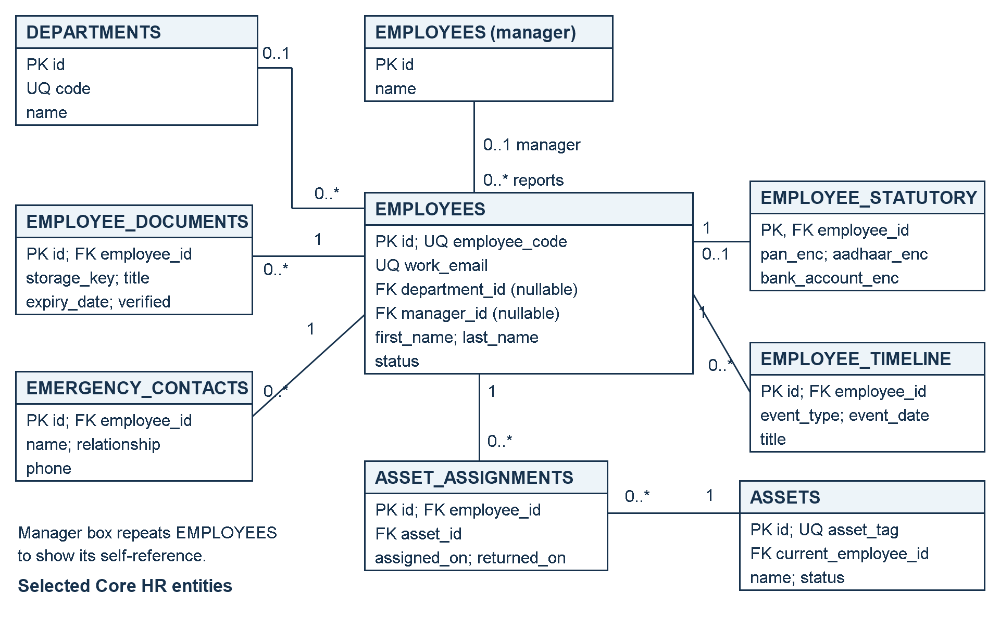
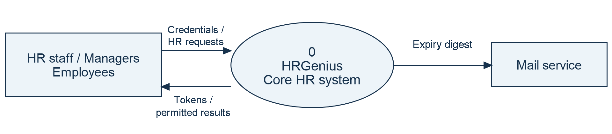
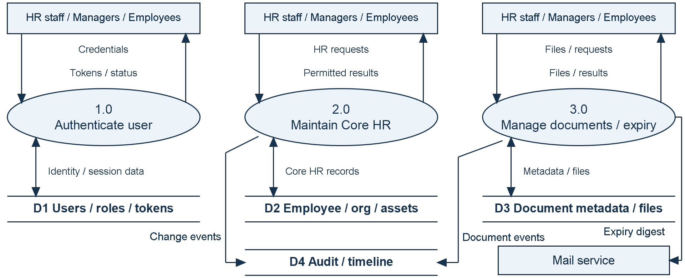

# HRGenius
## Human Resource Management System
### Detailed Project Report

**Project focus:** Secure, centralized management of employee information and core HR operations.

**Submitted by:** [Student Name]

**Register / Roll Number:** [Register Number]

**Department / Programme:** [Department and Programme]

**Institution:** [Institution Name]

**Project Guide:** [Guide Name]

**Academic Year:** [Academic Year]

## Abstract
HRGenius is a web-based Human Resource Management System designed to organize employee information and support routine HR administration through a common application. Organizations that maintain personnel records in spreadsheets, paper files, email attachments, and disconnected folders may encounter inconsistent data, slow information retrieval, limited accountability, and difficulty controlling access to confidential information. This project addresses these problems by providing structured employee records, organization master data, employee profiles, reporting relationships, document management, asset tracking, and an audit trail.

The application uses Angular 18 for its user interface, Java 21 with Spring Boot 3.3.4 for backend services, and Oracle Free 23 as the intended database. Authentication uses access and refresh tokens, while permissions and employee-level access rules control available operations. Selected sensitive identifiers are encrypted in storage and masked in normal responses. Database migrations establish a repeatable schema and demonstration dataset.

This report describes the problem, objectives, scope, requirements, feasibility, architecture, database design, modules, workflows, security, deployment, testing approach, and future development. It is based on the supplied source repository. Foundation and Core HR features are represented in the implementation; attendance, leave, recruitment, payroll processing, and performance management remain future phases. Benefits are expected outcomes, and no measured productivity or performance improvement is claimed.

**Keywords:** HRMS, employee management, Angular, Spring Boot, Oracle, role-based access control.

<!-- PAGE -->
# Contents and Introduction

## Report contents
| Page | Topic |
| --- | --- |
| 1 | Title page and abstract |
| 2 | Contents and introduction |
| 3 | Problem statement and existing-system analysis |
| 4 | Objectives, scope, and feasibility study |
| 5 | Functional and non-functional requirements |
| 6 | Development approach, architecture, and use case diagram |
| 7 | Database design and entity-relationship diagram |
| 8 | Functional modules and user responsibilities |
| 9 | Context and Level 1 data flow diagrams |
| 10 | User interface, security, and deployment |
| 11 | Testing strategy and acceptance criteria |
| 12 | Benefits, limitations, future scope, and references |

## 1. Introduction
Human resource administration depends on reliable information about employees, their positions, departments, reporting managers, documents, and assigned equipment. Even basic activities, such as locating an employee's current department or identifying the holder of a company laptop, require records that are accurate and accessible to the right people. As an organization grows, maintaining these relationships across independent files becomes increasingly difficult.

An HR management application provides a shared environment for these activities. HR personnel maintain official records, managers access relevant team information, and employees use permitted self-service functions. Centralization alone is insufficient: the application must also distinguish public workplace information from personal and sensitive information, validate changes, and retain a history of significant actions.

## 1.1 Project overview
HRGenius implements these ideas through a browser interface connected to a REST API and a relational database. The current application includes a dashboard, employee directory, employee creation and editing, profile tabs, organization setup, an organization chart, document expiry views, assets, spreadsheet exchange, and audit-log access. The code is organized by functional area so that additional HR services can be introduced in later development phases.

## 1.2 Purpose and evidence basis
The purpose of this report is to explain the engineering and business reasoning behind the project in a formal academic format. Statements about implemented functions are drawn from the README, routes, controllers, services, migrations, dependency files, and existing test source. This is a source-based report, not a record of a completed production rollout or a user survey. The title-page placeholders should be replaced with the student's actual submission details.

<!-- PAGE -->
# Problem Statement and Existing System

## 2. Problem statement
The problem addressed by HRGenius is the absence of a single, structured, and access-controlled location for maintaining employee and organizational information. When records are distributed across spreadsheets, emails, paper files, and individual computers, staff may spend unnecessary time locating information, comparing versions, and manually coordinating updates. These methods also make it difficult to determine who changed a record and whether a person should be allowed to view it.

For example, an employee transfer can affect the department record, reporting manager, directory entry, and internal HR history. If each item is maintained separately, one file may show the new department while another continues to show the old manager. Similar inconsistencies can occur when equipment is reassigned or an employee submits a replacement document. The system should represent these related activities through consistent records and controlled workflows.

## 2.1 Existing-system analysis
For this study, the existing system is an assumed manual or partially computerized process. It is used as a design baseline rather than as a claim about a particular organization's current operations. Employee details are entered in spreadsheets, documents are stored in folders, and changes are communicated through email or verbal instructions. Access often depends on possession of the file instead of a clearly defined application permission.

| Problem area | Limitation of the assumed existing process |
| --- | --- |
| Data consistency | Multiple copies can contain conflicting employee information. |
| Information retrieval | Staff search several files to assemble a complete profile. |
| Confidentiality | Shared files may expose more information than a task requires. |
| Document follow-up | Expiry dates depend on manual checking and reminders. |
| Asset accountability | Ownership and return history may be recorded separately. |
| Change tracking | The reason, author, and timing of a change may be unclear. |
| Reporting structure | Transfers may leave reporting relationships out of date. |

## 2.2 Causes and operational impact
These difficulties arise from duplicate entry, inconsistent naming, weak validation, disconnected storage, and limited permission control. Their practical effects include repeated administrative work, delayed responses to employee requests, incomplete handovers, and uncertainty about the current version of a record. As the number of employees and locations increases, informal coordination becomes harder to maintain.

## 2.3 Need for the project
A suitable solution should maintain one logical employee record, connect it to validated organizational data, restrict sensitive information, and record important changes. HRGenius therefore concentrates first on a dependable Core HR foundation. Establishing trustworthy employee data is also a prerequisite for future attendance, recruitment, and payroll modules. The project's success should be evaluated through data consistency, correct authorization, usable workflows, and verified functional behavior rather than unsupported claims about percentage savings.

<!-- PAGE -->
# Objectives, Proposed System, and Scope

## 3. Primary objective
The primary objective is to develop a centralized, maintainable HR application that enables authorized users to manage employee information and related administrative records through a consistent web interface.

## 3.1 Specific objectives
1. Maintain searchable employee records and structured personal and employment profiles.
2. Standardize organizational data and represent reporting relationships through an organization chart.
3. Enforce authentication, permissions, employee-level access, and sensitive-field protection.
4. Manage documents, verification, expiry alerts, company assets, and allocation history.
5. Support validated spreadsheet import and authorized export of employee data.
6. Record significant changes and provide a modular foundation for later HR services.

## 3.2 Proposed system
The proposed system replaces disconnected record handling with an Angular application connected to Spring Boot services and Oracle storage. Users sign in once and interact with screens appropriate to their responsibilities. Requests are validated and authorized on the server before data is returned or changed. Employee records reference organization masters so that department, location, and designation values remain consistent across profiles.

HR staff can maintain core records and review documents, managers can access permitted team information, and employees can access their own information and selected self-service operations. The dashboard summarizes available Core HR data, including people, departments, locations, team size where applicable, and documents needing attention.

## 3.3 Scope boundary
| Included in the current source | Planned for later phases |
| --- | --- |
| Login, token refresh, roles, and permissions | Attendance and leave administration |
| Employee records and organization masters | Recruitment and onboarding workflows |
| Profiles, directory, and organization chart | Payroll calculations and payslip generation |
| Documents, expiry digest, and assets | Performance reviews and goal management |
| Spreadsheet exchange, timeline, and audit log | Advanced analytics and report builder |

The presence of payroll-related roles, compensation fields, statutory information, or a PDF library does not establish an implemented payroll-processing module. Similarly, recording an employment status is distinct from implementing a complete onboarding or offboarding workflow.

## 3.4 Success criteria
Success requires consistent data, correct authorization, valid relationships, reliable workflows, and traceable changes. Proposed acceptance checks appear on page 11; operational benefits require separate measurement.

## 3.5 Feasibility analysis
**Technical:** Application layers, migrations, and tests provide a demonstrable foundation; Oracle verification remains necessary. **Operational:** Adoption needs training, clean master data, and defined HR ownership. **Economic and schedule:** Incremental delivery limits initial scope, while hosting, migration, support, and later modules require separate cost and effort estimates.

<!-- PAGE -->
# Functional and Non-functional Requirements

## 4. Functional requirements
The system shall authenticate users; maintain searchable employee records and organizational masters; enforce role and employee-level access; manage documents and expiry; track asset allocations; import and export spreadsheets; and display hierarchy, timeline, and audit records. These correspond to FR-01 through FR-08, respectively, with acceptance checks on page 11.

## 4.1 Non-functional requirements
The following requirements define system quality. Numeric values are proposed acceptance targets for evaluation, not measured results or established service commitments.

| Quality requirement | Requirement and verification criterion |
| --- | --- |
| NFR-01: Performance | Proposed target: 95% of directory searches complete within 2 seconds with 10,000 employees and 50 concurrent users. Verify by load testing in a documented environment. |
| NFR-02: Security and privacy | Enforce server-side permissions, protect selected sensitive identifiers, and restrict uploaded-file access. Verify that direct unauthorized requests fail and responses exclude restricted personal data. |
| NFR-03: Reliability and integrity | Preserve valid records after rejected operations; prevent duplicate identities, reporting cycles, and partial imports. Verify rollback, constraint, and failure scenarios through integration tests. |
| NFR-04: Availability | Proposed target: 99.5% monthly availability, excluding agreed maintenance. Monitor successful login and employee API checks; hosting and recovery arrangements must support this target. |
| NFR-05: Usability and accessibility | Provide clear labels, actionable errors, keyboard-operable controls, and visible focus. Verify login, employee search, and document upload through browser and representative-user checks. |
| NFR-06: Maintainability | Keep UI, business rules, and persistence separate; version database changes and document APIs. Verify changes through code review, automated tests, and repeatable builds. |
| NFR-07: Scalability | Preserve correct behavior as employee volume and concurrency increase. Test progressively larger workloads; review pagination, indexes, memory, and bottlenecks before expanding deployment capacity. |
| NFR-08: Compatibility and portability | Support the agreed browser matrix and reproducible setup. Verify key workflows in Chrome, Edge, and Firefox, plus target Oracle deployment and documented development configurations. |
| NFR-09: Backup and recovery | Back up database records and uploaded files consistently. Proposed recovery point: 24 hours; recovery time: 4 hours. Verify through a timed restoration exercise and document checks. |
| NFR-10: Auditability | Record actor, action or change, affected record, and time for significant operations. Verify history after changes and sensitive reveals; restrict audit access to authorized users. |

## 4.2 Software and environment requirements
The project targets Java 21, Spring Boot 3.3.4, Angular 18, Node.js 20+, and Oracle Free 23. Maven Wrapper and Docker Compose support setup; H2 supports development and tests. Hardware capacity must be validated under the proposed workload. No hardware minimum has been measured.

<!-- PAGE -->
# Development Approach and Architecture

## 5. Development approach
The roadmap follows incremental delivery: establish authentication and application infrastructure, implement Core HR, and then extend the shared employee foundation. A suitable iteration defines a use case, designs its data and permissions, implements the service and screen, and verifies its behavior. The repository does not establish a particular team's sprint history.

## 5.1 Use case diagram

The general authenticated-user actor covers common functions. Specialized actors inherit those functions through the UML generalization arrows. HR administration represents users with the relevant permissions; manager and employee access remains subject to server-side checks. The external mail service supports expiry-digest delivery.

## 5.2 Layer responsibilities
**Presentation layer:** Angular standalone components provide forms, profile tabs, lists, and navigation. Services call the API, and guards control navigation. Feature routes are lazy loaded.

**Application layer:** Spring Boot controllers expose `/api/v1` endpoints. Services enforce business rules, authorization, transactions, and history recording. Data transfer objects define requests and responses.

**Persistence layer:** JPA repositories access Oracle records. Constraints protect relationships and uniqueness, while Flyway migrations provide reproducible schema changes.

## 5.3 Request flow
Browser requests pass through security and controllers to business services and repositories. Services validate changes, apply employee-level access rules, and write history where appropriate. File storage and mail support the main application. Figure 3 on page 9 shows the system boundary; Figure 4 decomposes its data processing.

<!-- PAGE -->
# Database Design and Relationships

## 6. Database design principles
Relational tables represent employees, organization masters, permissions, documents, and assets. Primary and foreign keys establish identity and relationships. Unique constraints protect employee codes, work email, and asset tags. Oracle sequences generate identifiers. Business validation complements these database rules.

## 6.1 Entity-relationship diagram

PK denotes a primary key, FK a foreign key, and UQ a unique value. Relationship labels show the number of records at each end: 0..1 means optional one, and 0..* means zero or more. The diagram shows selected core tables, not the complete schema. Designation, grade, location, business unit, and cost center also link to employees through master-data foreign keys. The database permits a nullable department reference; the employee creation workflow can impose stricter required-field validation.

## 6.2 Authentication and additional relationships
Users and roles have a many-to-many relationship through `user_roles`. Roles and permissions similarly use `role_permissions`. Refresh tokens belong to users. An optional `users.employee_id` connects an account to an employee; the reviewed schema does not declare this foreign key unique. Audit records identify affected entities using entity type and identifier fields, rather than a direct employee foreign key.

## 6.3 Integrity, history, and storage
The manager field is a self-reference; application checks reject reporting cycles. Master data in use cannot be removed in ways that break employee references. Asset assignment history preserves previous allocations separately from the current holder. Document rows store metadata and keys, while files are stored separately. Selected statutory identifiers use encrypted columns. Creation and modification fields, soft deletion, timeline events, and audit records support traceability. Timelines and audit logs have different audiences and must respect confidentiality rules.

<!-- PAGE -->
# Functional Modules and User Responsibilities

## 7. Authentication and organization setup
The authentication module supports login, token refresh, logout-related refresh-token revocation, and account lockout after repeated failed attempts. Roles and permission codes provide the foundation for operation-level access. Organization setup maintains reusable HR masters, allowing an employee's department, designation, grade, location, business unit, and cost center to reference consistent records.

## 7.1 Employee directory and profiles
The directory provides searchable employee information and navigation to profiles. The creation and editing interface captures employee details through a structured workflow. Profile views organize related information into sections for core details, statutory information, emergency contacts, documents, assets, and timeline events. The server determines which information the caller may receive. An employee can appear in the workplace directory without making all personal fields visible to every authenticated user.

Employee records capture employment status and meaningful changes. The organization chart visualizes reporting relationships; it is not a complete workforce-planning module.

## 7.2 Documents, assets, and spreadsheet exchange
**Document management:** Authorized users upload employee documents with metadata. The service supports retrieval and document-related actions according to access rules. Expiry dates feed a dedicated review screen and a scheduled HR email digest. Verification status helps distinguish reviewed records from newly submitted material.

**Asset management:** Asset records identify company equipment and its current status or holder. Assignment history links an asset to employees over time and stores return information. This supports accountability during transfers and exits, although a full offboarding checklist remains a future extension.

**Spreadsheet exchange:** Import templates standardize employee data entry. Import validation checks the entire submitted dataset before creation. Exports use the employee filtering and access rules, with sensitive columns included only where permitted. This is a practical bridge from spreadsheet-based administration to the centralized application.

## 7.3 User responsibilities and visibility
| User category | Role in the current application |
| --- | --- |
| Super administrator / HR administrator | Broad administration subject to endpoint permissions. |
| HR manager | Full-profile access recognized by the access service; operations depend on granted permissions. |
| Payroll administrator | Recognized for profile access and sensitive-data permission; payroll processing is not implemented. |
| Manager | Full profiles within the permitted reporting tree; sensitive access is evaluated separately. |
| Employee | Directory access, own profile, and allowed self-service actions. |
| Recruiter | Role exists, but it does not confer broad full-profile access in the employee access service. |

## 7.4 Dashboard and auditing
Dashboard cards display actual Core HR counts obtained from application services. Manager and HR-specific cards provide team and expiry information where applicable. Audit-log access is separately permission-controlled. These views support awareness and accountability while preserving the distinction between general workplace data and protected employee information.

<!-- PAGE -->
# Data Flow Diagrams and Processing Logic

## 8. Context diagram (Level 0)

The single process represents the complete Core HR system. HR staff, managers, and employees exchange requests and permitted responses through an aggregated user entity. The mail service receives expiry digests. Internal databases and file storage are intentionally hidden at this level.

## 8.1 Level 1 data flow diagram

Rectangles denote external entities, rounded processes denote transformations, and paired horizontal lines denote data stores. Labelled arrows show data movement. Opposing arrowheads represent the two directions named in the label. The user entity is repeated for readability; it represents the same participants in both diagrams. Authentication is a shared prerequisite for processes 2.0 and 3.0. Internal flows decompose the context without adding a new external participant.

## 8.2 Processing and validation
Employee changes validate required fields, duplicate email, organizational references, and manager relationships before saving. Reporting-tree traversal uses a queue and a visited set; manager changes reject reporting cycles. Spreadsheet imports validate the whole dataset before employee creation, with a limit of 1,000 import rows and 10,000 export rows. Document processing validates content, stores file bytes separately from metadata, and selects expiry records for the HR digest. Asset updates preserve allocation and return history. Relevant actions also produce timeline or audit entries.

<!-- PAGE -->
# User Interface, Security, and Deployment

## 9. User interface design
The Angular interface uses a common application shell with navigation and reusable components for page headings, status chips, tables, empty states, and confirmation dialogs. Separate feature screens support the employee directory, employee forms, profile tabs, organization chart, organization setup, assets, document expiry, and audit log. Consistent controls reduce the effort required to learn each workflow. Forms should identify required fields and present validation failures close to the relevant action.

Route guards and role-driven navigation help users discover permitted features. These controls are a usability layer; the backend independently enforces authorization. Hiding a menu item is not sufficient protection for an API endpoint.

## 9.1 Authentication and data protection
Passwords are handled using BCrypt, and API authentication uses JWT access tokens. The authentication service rotates refresh tokens and revokes the previous token when issuing a replacement. Its lockout logic applies after five failed login attempts, with a 15-minute lock duration defined in the service. Logout revokes the supplied refresh token; this should not be described as immediate revocation of every previously issued access token.

Role and permission checks control operations, while the employee access service distinguishes directory visibility, full-profile access, and sensitive-field access. Selected identifiers, including PAN, Aadhaar, and bank account values, use an AES-GCM attribute converter. Masking supports ordinary viewing, and sensitive reveal actions have audit coverage. These mechanisms apply to selected fields rather than proving encryption of every database column or uploaded file.

Uploaded files use generated UUID storage keys, a content-type allow-list, signature checks, and validated storage paths. These are implemented validation measures; they do not constitute malware scanning or a comprehensive security certification. Audit records and employee timelines also require access controls because their content can reveal personnel changes.

## 9.2 Deployment design
Docker Compose defines Oracle, Spring Boot, an nginx-served frontend, and MailHog for development email capture. The configured local access points are frontend port 4200, backend port 8080, Oracle port 1521, and MailHog web port 8025. The backend waits for the Oracle health check before startup. Flyway applies schema migrations and seed data.

The H2 demonstration uses in-memory storage and resets its database after restart. It is useful for demonstrations and tests, but its behavior and persistence characteristics differ from the intended Oracle environment.

## 9.3 Operational readiness
A real deployment needs environment-specific secrets, HTTPS configuration, controlled administrator provisioning, database backups, and persistent uploaded-file storage. The Compose file explicitly provides an Oracle data volume; file-storage persistence should also be configured and restore-tested before operational use. MailHog should be replaced by an appropriate mail service where actual delivery is required. Recovery validation must confirm that restored document metadata still points to restored files. No deployment, load-test, or backup-restoration result is asserted in this report.

<!-- PAGE -->
# Testing Strategy and Acceptance Criteria

## 10. Verification approach
Testing should combine isolated business-rule tests, API integration tests, database migration checks, browser workflow checks, and environment-specific verification. The repository contains automated backend test source using JUnit, Mockito, Spring test support, MockMvc, and H2 in Oracle compatibility mode. Existing API integration tests exercise the application against seeded H2 data. Oracle Testcontainers dependencies are present, but their presence alone does not prove an Oracle integration suite was executed.

The following table identifies coverage visible in existing test source. These are test definitions reviewed for this report, not newly executed passing results.

## 10.1 Existing automated test coverage
| Test area | Scenarios visible in source |
| --- | --- |
| Authentication | Valid login, incorrect password, fifth-failure lockout, locked-account rejection. |
| Employee visibility | Directory access without others' personal data; manager team access without automatic sensitive access. |
| Employee changes | HR creation and working login; unauthorized creation; department-change timeline and audit. |
| Relationships and integrity | Reporting-loop rejection; deletion blocked for direct reports or masters in use. |
| Sensitive fields | Masking, audited reveal, encrypted database values, preservation of restricted salary fields. |
| Documents and file storage | Own-document permissions, valid PDF handling, disguised content, unsupported types, path traversal. |
| Spreadsheet import | All-or-nothing behavior and manager references within the same file. |
| Helpers and migrations | Search escaping, reporting-tree traversal, seed records, and sequential employee codes. |

## 10.2 Proposed acceptance checks
**AC-01 - Access boundary:** Sign in as HR, manager, and employee. Confirm that each can perform permitted actions and that direct unauthorized API requests are rejected. Map this to FR-01 and FR-04.

**AC-02 - Employee integrity:** Create and edit an employee, attempt a duplicate email, select invalid master references, and attempt a reporting cycle. Confirm clear errors and unchanged valid records. Map this to FR-02, FR-03, and FR-08.

**AC-03 - Administrative workflows:** Upload and retrieve a permitted document, review an expiry record, assign and return an asset, and inspect the resulting history. Map this to FR-05, FR-06, and FR-08.

**AC-04 - Bulk operations:** Import a valid spreadsheet and a spreadsheet containing an invalid row. Confirm complete valid processing or a validation report without partial employee creation. Check that exports respect sensitive-field access. Map this to FR-07.

## 10.3 Execution and result reporting
Run `mvnw.cmd test` from the `backend` directory on Windows. The frontend production build uses `npm run build` from `frontend` after dependencies are installed. This reporting task did not execute either suite. Record actual results before submission. Additional checks should cover browser usability, Oracle behavior, concurrent asset operations, load, and recovery.

<!-- PAGE -->
# Benefits, Limitations, and Future Scope

## 11. Expected benefits and current limitations
HRGenius is expected to make employee information easier to locate, reduce duplicate entry, standardize organizational records, improve asset accountability, and support document follow-up. Role-aware access and traceable changes can strengthen administrative control. These are reasoned benefits of the design, not measured outcomes from a deployed organization.

The current scope is Foundation and Core HR. Attendance, leave, recruitment, payroll processing, and performance reviews remain future modules. Production-scale performance, comprehensive browser testing, and recovery readiness are unverified. Larger deployments require evaluation of spreadsheet limits, file storage, data quality, and operational ownership.

## 11.1 Future enhancements
1. Add attendance capture, shift rules, leave balances, and approval workflows linked to existing employee records.
2. Add recruitment pipelines and onboarding/offboarding checklists, reusing documents, employee identities, and asset history.
3. Implement payroll structures, calculation runs, payslips, and expense workflows with separately validated business rules.
4. Introduce performance goals, reviews, feedback, and manager evaluation workflows with appropriate confidentiality controls.
5. Extend dashboards with defined business metrics, configurable reports, and export permissions.
6. Improve operational maturity through automated delivery checks, persistent document storage, monitoring, load tests, and restoration exercises.

## 11.2 Conclusion
HRGenius provides a structured technical foundation for centralized employee administration. Its Angular interface, Spring Boot service layer, and relational database connect employee profiles, organizational data, documents, assets, and change history within one application. The implementation emphasizes validation and differentiated access, which are essential when workplace information and confidential personal details coexist. The next stage should verify the current workflows in the target environment and then introduce additional HR modules incrementally. The project demonstrates how established software-engineering practices can be applied to a practical organizational information problem.

## 12. References and source evidence
The report uses the supplied repository as its primary source; no external survey or benchmark is cited.

- **Project overview and roadmap:** `README.md`.
- **Technology and deployment:** `backend/pom.xml`, `frontend/package.json`, and `docker-compose.yml`.
- **UI and implemented routes:** `frontend/src/app/app.routes.ts` and `frontend/src/app/features/`.
- **Schema:** `backend/src/main/resources/db/migration/`, particularly V1, V3, and V4; Java seed migration under `employee/seed/`.
- **Business rules and access:** `backend/src/main/java/com/hrgenius/employee/service/` and `auth/service/AuthService.java`.
- **Security and uploads:** backend `common/security/`, `common/config/SecurityConfig.java`, and `common/storage/FileStorageService.java`.
- **Test evidence:** `backend/src/test/java/com/hrgenius/`, including authentication, employee API, migration, employee logic, search, and file-storage tests.
